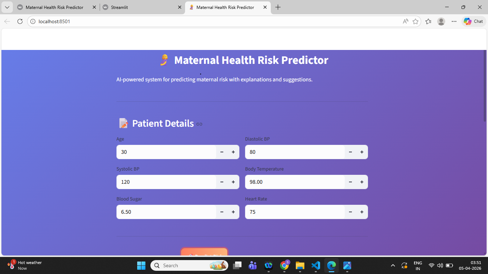
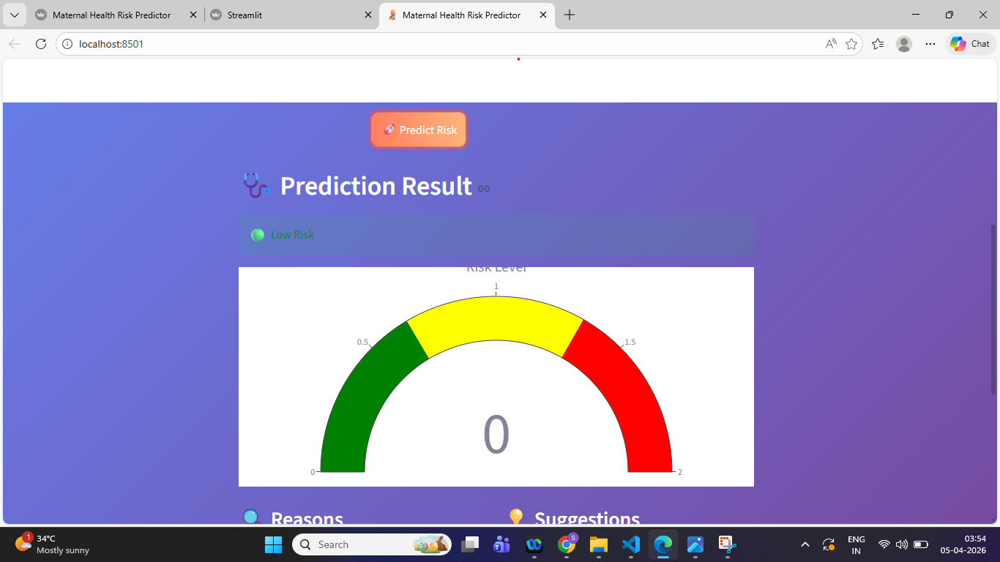
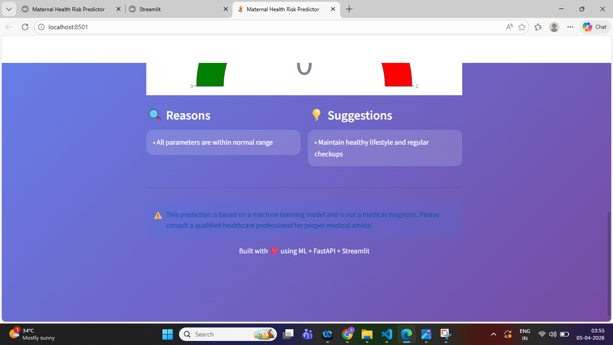

# 🤰 Maternal Health Risk Prediction System

## 🚀 Overview

This project is an **AI-powered Maternal Health Risk Prediction System** that predicts the risk level of pregnant women based on medical parameters such as blood pressure, blood sugar, body temperature, and heart rate.

It not only predicts risk but also provides:

* 🔍 Explainable reasons
* 💡 Personalized health suggestions
* ⚠️ Medical disclaimer

---

## 🎯 Problem Statement

Maternal health complications are a major concern, especially in early diagnosis.
This system helps in **early risk detection** and provides actionable insights to support healthcare decisions.

---

## 🧠 Features

* ✅ Machine Learning Classification Model (XGBoost)
* ✅ Feature Engineering (AgeGroup, MeanBP, RiskScore)
* ✅ Model Comparison (Logistic Regression, Random Forest, XGBoost)
* ✅ Explainable AI (Reasons for prediction)
* ✅ Health Recommendations (Suggestions)
* ✅ FastAPI Backend (REST API)
* ✅ Streamlit Frontend (Interactive UI)
* ✅ Risk Meter Gauge Visualization
* ✅ Gradient UI with Glassmorphism Design
* ✅ Ethical AI Disclaimer

---

## 🛠 Tech Stack

**Frontend**

* Streamlit
* Plotly

**Backend**

* FastAPI
* Uvicorn

**Machine Learning**

* Scikit-learn
* XGBoost
* Pandas, NumPy

**Visualization**

* Matplotlib
* Seaborn

---

## 📊 Input Features

* Age
* Systolic Blood Pressure
* Diastolic Blood Pressure
* Blood Sugar (BS)
* Body Temperature
* Heart Rate

---

## 📈 Output

* Risk Level (Low / Mid / High)
* Reasons for prediction
* Health suggestions
* Risk gauge visualization

---

## 🧪 Model Performance

* Accuracy: **~83%**
* Best Model: **XGBoost**
* Evaluation Metrics:

  * Precision
  * Recall
  * F1 Score

---

## 🏗 Project Structure

```
maternal-health-risk/
│
├── data/
│   └── maternal_health.csv
│
├── src/
│   ├── train.py
│   ├── pipeline.py
│   ├── predict.py
│
├── api/
│   └── main.py
│
├── app/
│   └── app.py
│
├── models/
│   ├── model.pkl
│   ├── confusion_matrix.png
│   ├── feature_importance.png
│
├── notebooks/
│   └── eda.ipynb
│
├── requirements.txt
└── README.md
```

---

## ⚙️ Installation

### 1. Clone the repository

```
git clone https://github.com/your-username/maternal-health-risk.git
cd maternal-health-risk
```

### 2. Create virtual environment

```
python -m venv venv
venv\Scripts\activate
```

### 3. Install dependencies

```
pip install -r requirements.txt
```

---

## ▶️ Run the Project

### 🔹 Start Backend (FastAPI)

```
uvicorn api.main:app --reload
```

### 🔹 Start Frontend (Streamlit)

```
streamlit run app/app.py
```

---

## 🌐 API Endpoints

### GET /

Check API status

### POST /predict

Input:

```
{
  "Age": 30,
  "SystolicBP": 130,
  "DiastolicBP": 80,
  "BS": 7.0,
  "BodyTemp": 98.0,
  "HeartRate": 75
}
```

Output:

```
{
  "RiskLevel": "Mid Risk",
  "Reasons": [...],
  "Suggestions": [...],
  "Disclaimer": "..."
}
```

---

## 📸 Screenshots
## 📸 Screenshots

### 🧾 Input Form


### 📊 Prediction Result


### 💡 Suggestions & Disclaimer



---

## ⚠️ Disclaimer

This system is based on a machine learning model and is **not a medical diagnosis tool**.
Please consult a qualified healthcare professional for medical advice.

---

## 💡 Future Improvements

* 🔹 SHAP Explainability
* 🔹 Real-time data integration
* 🔹 User authentication system

---

## 👩‍💻 Author

**sandhyarani panuganti**

---

## ⭐ If you like this project, give it a star!
